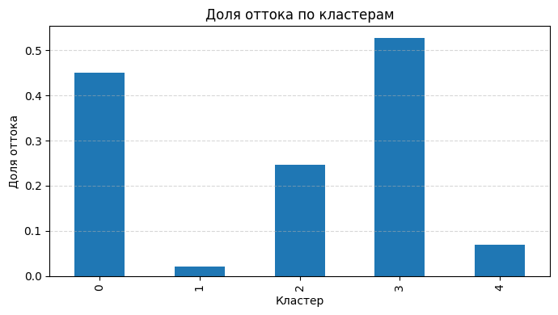
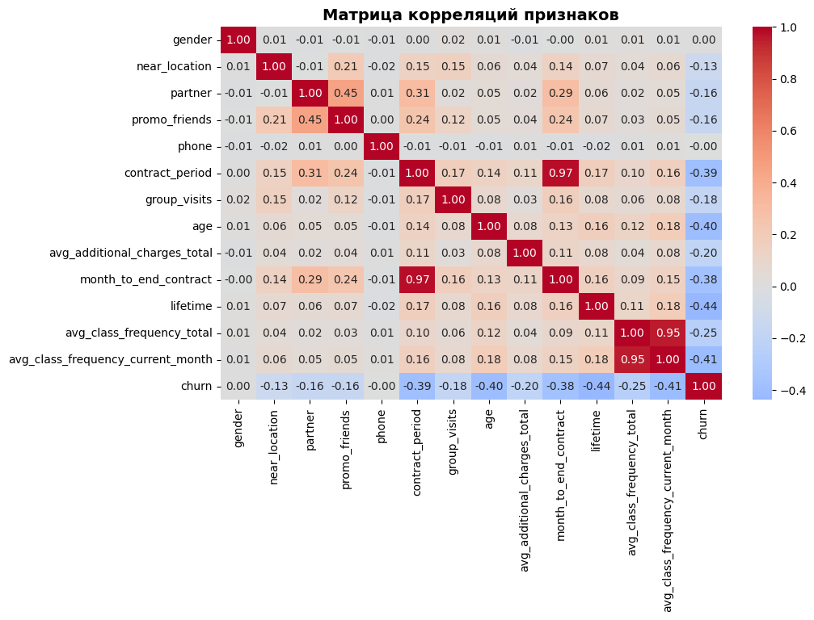
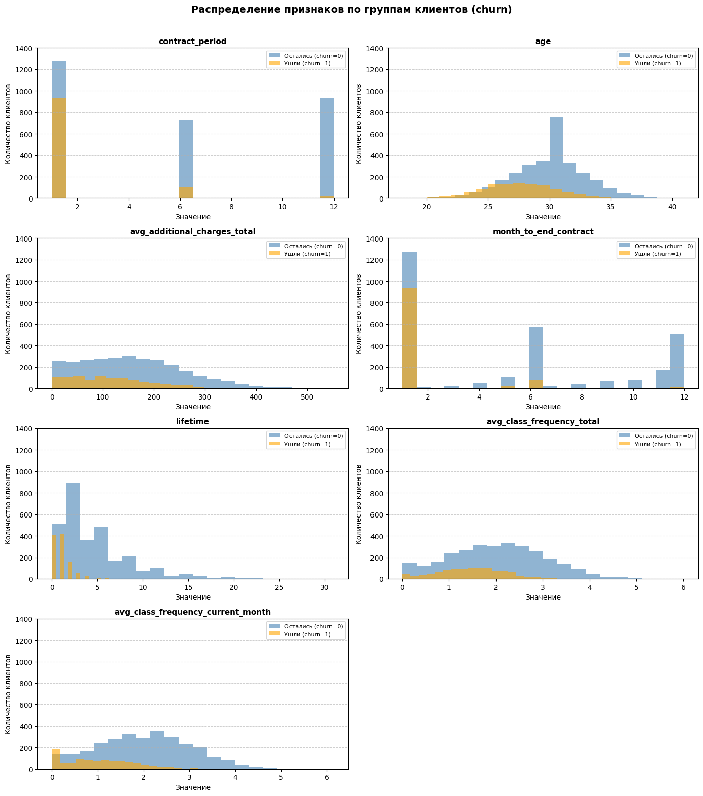

# Прогнозирование оттока клиентов фитнес-клуба

## О проекте
Проект посвящён анализу клиентской базы фитнес-клуба, прогнозированию оттока и сегментации клиентов.  
В работе используются методы исследовательского анализа данных, бинарной классификации и кластеризации, чтобы выявить признаки оттока, спрогнозировать вероятность ухода клиента и выделить клиентские группы с разным уровнем риска. 

Цель проекта — показать, как с помощью аналитики и методов машинного обучения можно заранее выявлять клиентов, склонных к оттоку, и использовать эти выводы для повышения удержания. 

## Бизнес-задача
Сеть фитнес-центров стремится снизить отток клиентов и выстроить более эффективную стратегию взаимодействия с ними.  
Для этого важно понимать:
- какие признаки сильнее всего связаны с уходом клиентов;
- можно ли заранее прогнозировать отток на уровне следующего месяца;
- какие группы клиентов наиболее склонны к уходу;
- какие меры удержания стоит применять к разным сегментам клиентской базы. 

## Задачи
- подготовить и проверить данные о клиентах фитнес-клуба для дальнейшего анализа;
- провести исследовательский анализ данных и сравнить профиль клиентов, ушедших в отток и оставшихся;
- выявить признаки, наиболее связанные с риском оттока;
- построить модель бинарной классификации для прогнозирования ухода клиента в следующем месяце;
- обучить и сравнить две модели — логистическую регрессию и случайный лес — по метрикам качества;
- выполнить сегментацию клиентской базы и выделить группы клиентов с разным уровнем риска;
- определить, какие сегменты наиболее склонны к оттоку, а какие отличаются высокой лояльностью;
- сформулировать рекомендации по удержанию клиентов на основе результатов анализа и сегментации. 

## Инструменты и технологии
- **Python** — основной язык анализа данных;
- **pandas** — загрузка, очистка, агрегация и сравнительный анализ клиентских данных;
- **NumPy** — численные вычисления и подготовка данных к моделированию;
- **matplotlib** — визуализация распределений признаков, корреляций и различий между сегментами;
- **scikit-learn** — построение и оценка моделей машинного обучения: `train_test_split`, `LogisticRegression`, `RandomForestClassifier`, метрики `accuracy`, `precision`, `recall`;
- **StandardScaler** — масштабирование признаков перед кластеризацией;
- **KMeans** — сегментация клиентской базы на кластеры;
- **SciPy** — расчёт матрицы расстояний и поддержка кластерного анализа;
- **Jupyter Notebook** — среда для пошагового анализа, моделирования и оформления выводов. 

## Визуализация проекта

## Структура репозитория
- `README.md` — описание проекта
- `customer_churn_prediction_ml.ipynb` — ноутбук с анализом, моделированием, кластеризацией и выводами
- `images/` — графики, используемые в README

## Как открыть проект
Проект представлен в виде Jupyter Notebook с кодом, расчётами, визуализациями и выводами.
